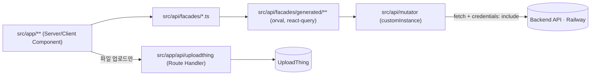
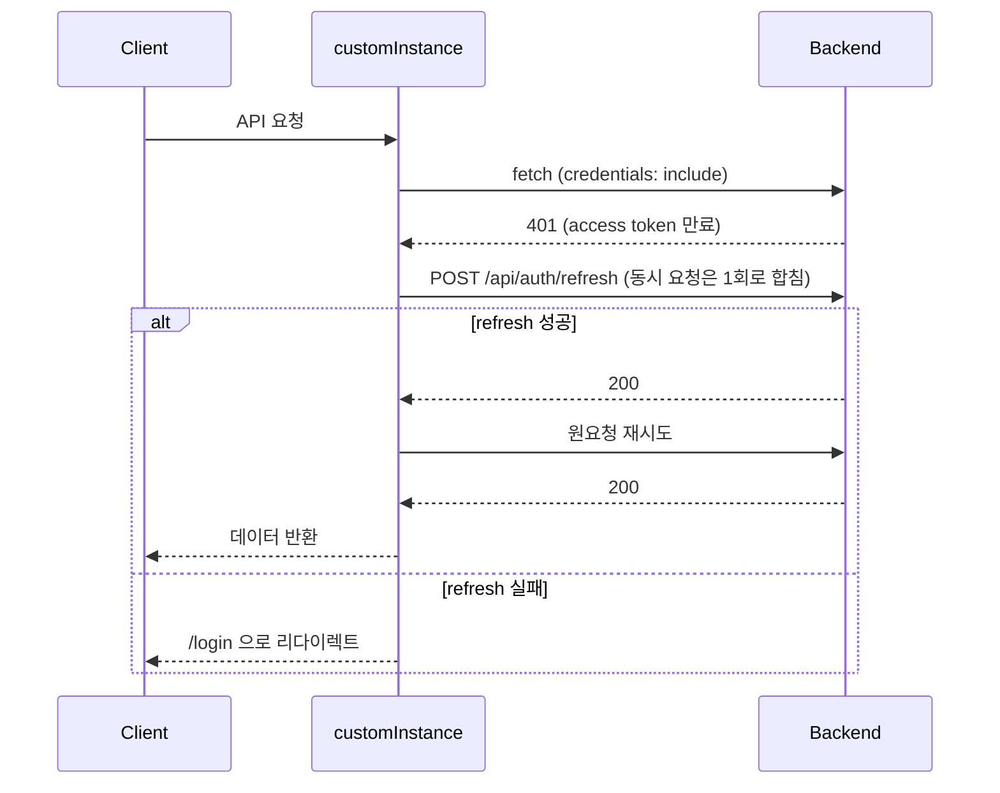
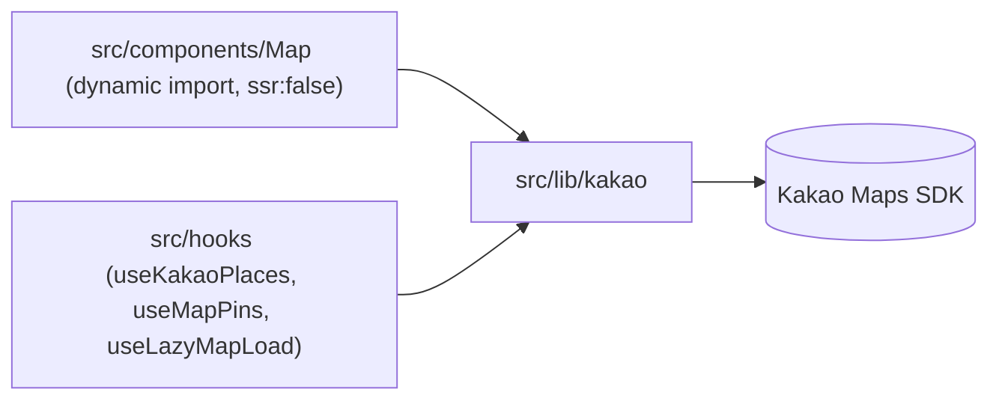

# ARCHITECTURE.md

Peakda 프런트엔드(Next.js, Vercel)와 백엔드(Railway) 간 실제 데이터 흐름. 세부 디렉터리는 `src/CLAUDE.md`, `public/CLAUDE.md` 참고.

## API 호출 흐름

- 새 API 도메인: swagger 갱신 → `pnpm generate:api` → `pnpm generate:facades` → 파사드 TODO 채우기 (`src/CLAUDE.md` 참고).

## 인증 흐름 (토큰 refresh)

> **Note**: 프런트(Vercel)·백엔드(Railway) 도메인이 달라 크로스사이트 쿠키(`SameSite=None; Secure`)로 인증을 주고받는다. 이 때문에 `src/api/mutator/index.ts`는 `NEXT_PUBLIC_API_URL`로 **브라우저/서버에서 백엔드를 직접 호출**하는 것이 의도된 설계다 (`AGENTS.md` API 호출 규칙과 일치, 2026-07-19 정합). Route Handler 프록시 패턴은 `src/app/api/uploadthing` (파일 업로드)에만 적용된다.

## 카카오맵 흐름

## 상태 관리 계층

| 계층 | 도구 | 위치 |
| --- | --- | --- |
| 서버 상태 (API 데이터) | TanStack Query | `src/api/facades/generated/**` 훅 |
| 클라이언트 전역 상태 | Zustand | `src/stores/` |
| 탭 등 국소 공유 상태 | React Context | `src/context/TabContext.tsx` (신규 공유 상태는 Zustand 우선 검토) |
| 로컬 UI 상태 | useState | 컴포넌트 내부 |
