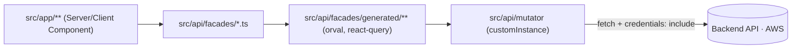
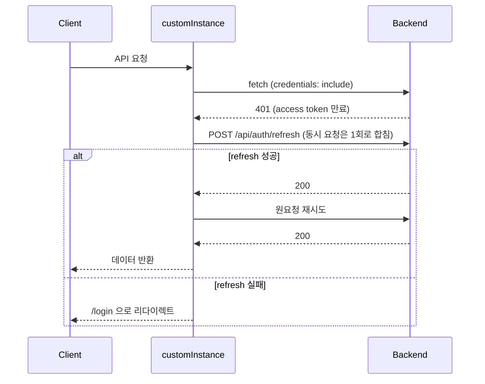
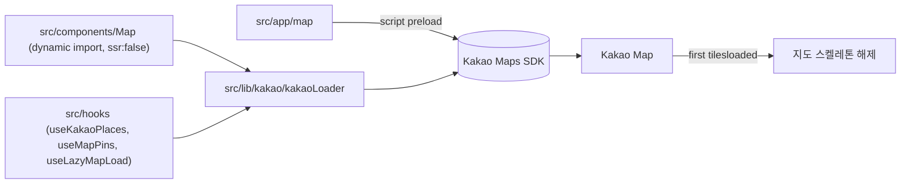

# ARCHITECTURE.md

Peakda 프런트엔드(Next.js, Vercel)와 백엔드(AWS) 간 실제 데이터 흐름. 세부 디렉터리는 `src/CLAUDE.md`, `public/CLAUDE.md` 참고.

## API 호출 흐름

- 이미지 업로드도 백엔드 API(`uploadProfileImageApi`, `uploadSpotRecordPhotosApi`)로 처리한다. `src/app/api` Route Handler는 없다 (2026-08-08 미사용 uploadthing 라우트 제거).

- 새 API 도메인: swagger 갱신 → `pnpm generate:api` → `pnpm generate:facades` → 파사드 TODO 채우기 (`src/CLAUDE.md` 참고).
- 응답 언래핑: 파사드에서 `res.data`(orval 래퍼) → `res.data.data`(백엔드 실제 payload) 순으로 벗겨 앱에 노출한다.

## 인증 흐름 (토큰 refresh)

> **Note**: 프런트(Vercel)·백엔드(AWS) 도메인이 달라 크로스사이트 쿠키(`SameSite=None; Secure`)로 인증을 주고받는다. 이 때문에 `src/api/mutator/index.ts`는 `NEXT_PUBLIC_API_URL`로 **브라우저/서버에서 백엔드를 직접 호출**하는 것이 의도된 설계다 (`CLAUDE.md` API 호출 규칙과 일치, 2026-07-19 정합). Route Handler 프록시는 어디에도 쓰지 않는다.

## 카카오맵 흐름

- `/map` 서버 HTML에서 SDK를 preload하고, 클라이언트 진입 즉시 로더가 실행된다.
- 수동 타일 prefetch와 Cache API 서비스워커는 카카오맵 자체 타일 요청과 경쟁하거나 요청마다 캐시 조회를 추가해 제거했다. `public/map-tile-sw.js`는 기존 설치본과 캐시를 정리하는 용도로만 남아 있다.

## 상태 관리 계층

| 계층 | 도구 | 위치 |
| --- | --- | --- |
| 서버 상태 (API 데이터) | TanStack Query | `src/api/facades/*.ts` (generated 훅을 감싼 파사드) — 페이지는 generated를 직접 쓰지 않는다 |
| 클라이언트 전역 상태 | Zustand | `src/stores/` |
| 탭 등 국소 공유 상태 | React Context | `src/context/TabContext.tsx` (신규 공유 상태는 Zustand 우선 검토) |
| 로컬 UI 상태 | useState | 컴포넌트 내부 |
