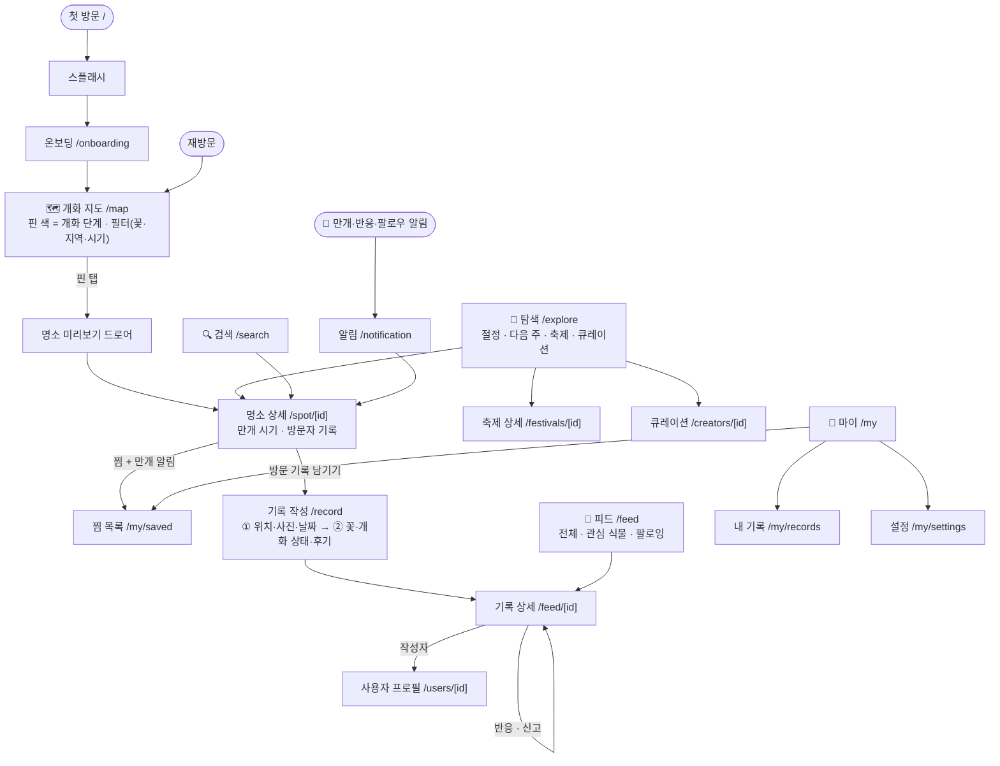
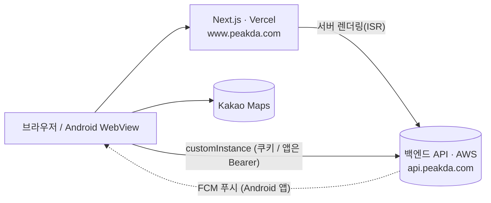

# 피크다 Peakda

**계절 명소를 가장 예쁠 때 가도록 알려주는 서비스.**
벚꽃·수국·단풍·억새 같은 계절 명소의 개화 상태를 지도에서 보고, 절정 시기에 맞춰 여행을 계획하고, 다녀온 기록을 남깁니다.

- 웹: https://www.peakda.com
- Android 앱: 같은 웹을 Capacitor 로 감싼 앱 (`com.peakda.app`, Google Play 출시 준비 중)

---

## 무엇을 해결하나

꽃은 1~2주면 지는데, "지금 가면 피어 있을까?"를 알기 어렵습니다. 피크다는 이 질문에 답합니다.

| 기능 | 설명 |
| --- | --- |
| 🗺️ 개화 지도 | 전국 명소를 개화 단계(개화 전 → 이르다 → 개화 시작 → 만개 → 개화 종료) 색으로 표시. 꽃 종류·지역·시기로 필터 |
| 📅 절정 시기 예측 | 명소마다 올해 만개 예상 기간과 "언제 기준 예측인지"를 보여줌 |
| 🔔 만개 알림 | 찜한 명소가 절정에 가까워지면 알림 (앱 푸시 — 앱 쪽은 준비 완료, 백엔드 발송 연동 대기) |
| 📸 방문 기록 | 다녀온 명소의 사진·꽃 상태·후기를 남기고, 다른 사람의 기록으로 현장 상황 확인 |
| 🧭 탐색 | "지금이 절정", "다음 주에 가면 좋을 곳", 진행 중인 축제, 에디터 큐레이션 |
| 👥 소셜 | 피드, 이모지 반응, 팔로우, 알림 |

---

## 사용자 흐름



### 로그인 없이도 둘러볼 수 있습니다

지도·탐색·피드·명소·축제·큐레이션은 **비로그인으로 열립니다.**
찜, 알림, 기록 작성, 반응, 팔로우처럼 내 계정이 필요한 동작을 하면 그 자리에서 **로그인 바텀시트**가 뜨고(구글·카카오·네이버), 로그인 후 하던 화면으로 돌아옵니다.

| 비로그인 가능 | 로그인 필요 |
| --- | --- |
| `/`, `/map`, `/explore`, `/search`, `/spot/[id]`, `/feed`, `/feed/[id]`, `/festivals/[id]`, `/creators/[id]`, `/my`(안내 화면) | `/record`, `/my/saved`, `/my/records`, `/my/settings`, `/notification`, `/profile/edit`, `/followers`, `/following`, `/users/[id]` |

막힌 경로 목록은 `src/lib/auth/session.ts` 의 `PROTECTED_PATHS` 한 곳에서 관리합니다.

---

## 기술 스택

| 영역 | 사용 |
| --- | --- |
| 프레임워크 | Next.js 15 (App Router) · React 19 · TypeScript strict |
| 스타일 | Tailwind CSS v4 · Pretendard · vaul(바텀시트) · sonner(토스트) |
| 상태 | TanStack Query(서버 상태) · Zustand(전역 UI 상태) |
| API | orval 로 Swagger 에서 클라이언트·타입 자동 생성 → 도메인별 파사드 |
| 지도 | Kakao Maps SDK |
| 앱 | Capacitor 8 (Android) · FCM 푸시 |
| 테스트·품질 | Vitest · ESLint · Prettier · GitHub Actions |
| 배포 | Vercel (웹) · Google Play (앱) |

### 구조 한눈에



- 프런트와 백엔드는 도메인이 달라 **브라우저가 백엔드를 직접 호출**합니다(Route Handler 프록시 없음).
- 명소·피드·축제 상세는 **서버 렌더링 + ISR** 로 검색엔진에 노출되고, 로그인 사용자별 상태(찜·반응)는 클라이언트가 다시 채웁니다.
- 앱은 실행할 때마다 `https://www.peakda.com` 을 불러오므로, **화면 변경은 웹 배포만으로 앱에도 반영**됩니다(네이티브 설정 변경만 재빌드).

자세한 흐름은 [ARCHITECTURE.md](ARCHITECTURE.md) 를 보세요.

---

## 시작하기

Node.js 22 이상, pnpm 10 이 필요합니다 (`package.json` 의 `engines`·`packageManager`).

```bash
pnpm install
pnpm dev          # http://localhost:3000
```


### 자주 쓰는 명령

```bash
pnpm typecheck         # 타입 체크
pnpm lint              # 린트
pnpm test              # Vitest
pnpm build             # 프로덕션 빌드
pnpm validate:context  # 문서 속 경로가 실제로 있는지 검사
pnpm generate:api      # Swagger → orval 클라이언트 재생성
pnpm cap:sync          # 웹 설정을 Android 프로젝트에 동기화 (CAPACITOR_SERVER_URL 필요)
```

---

## 디렉터리

```
src/
├─ app/            # 라우트 (App Router). 화면별 _components 포함
├─ api/
│  ├─ facades/     # 도메인별 API 훅 (화면은 여기만 쓴다)
│  │  └─ generated/  # orval 생성 코드 — 직접 수정 금지
│  └─ mutator/     # fetch 래퍼 · 401 시 토큰 갱신
├─ components/     # Map(카카오맵) · ui(공용) · auth(로그인 시트) · notification
├─ hooks/  stores/  constants/  lib/  types/
android/           # Capacitor Android 프로젝트
docs/              # 진행 현황·백엔드 요청서·설계 기록
```

디렉터리별 규칙은 [src/CLAUDE.md](src/CLAUDE.md) 에 있습니다.

---

## 개발 흐름

- 브랜치를 만들어 작업하고 **`main` 으로 PR** 을 올립니다. `main` 은 보호돼 있어 PR 과 `ci` 체크 통과가 필요합니다.
- PR 마다 GitHub Actions 가 `validate:context → lint → typecheck → test → build` 와 Android 빌드를 돌리고, Vercel 이 미리보기를 배포합니다.
- PR 제목은 `[feat] 내용` 형식입니다 (`feat / fix / chore / refactor / style / docs`).

---

## 문서

| 문서 | 내용 |
| --- | --- |
| [CLAUDE.md](CLAUDE.md) | 작업 원칙과 코딩 규칙 |
| [ARCHITECTURE.md](ARCHITECTURE.md) | API 호출·인증·카카오맵·상태 관리 흐름 |
| [MEMORY.md](MEMORY.md) | 코드만 봐서는 알 수 없는 결정과 이유 |
| [docs/TODO.md](docs/TODO.md) | Google Play 출시까지 남은 일 |
| [docs/UX_BACKLOG.md](docs/UX_BACKLOG.md) | 알고 있지만 아직 고치지 않은 사용자 흐름 문제 |
| [docs/BACKEND_API_REQUESTS.md](docs/BACKEND_API_REQUESTS.md) | 백엔드에 전달한 요청서 |
| [docs/SEO_GEO_AUDIT.md](docs/SEO_GEO_AUDIT.md) | 검색 노출(SEO) 점검과 진행 현황 |
| [docs/design-tokens.md](docs/design-tokens.md) | Figma 디자인 토큰 원본 |
