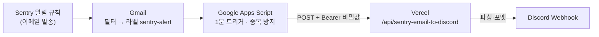

# Sentry 알림 → Discord 중계

Sentry 무료 플랜에서 Discord 공식 연동을 쓰지 않고, **Sentry 알림 이메일을 Discord 채널로 옮겨 보내는** 구성이다.



| 구성 요소 | 파일 | 하는 일 |
| --- | --- | --- |
| Route Handler | `src/app/api/sentry-email-to-discord/route.ts` | 비밀값 검증 → 메일 해석 → Discord 전송. 상태 없음 |
| 메일 해석 | `src/lib/sentryAlert/sentryEmail.ts` | Sentry 메일 판별, 제목·프로젝트·환경·이슈 링크·요약 추출 |
| 메시지 포맷 | `src/lib/sentryAlert/discordMessage.ts` | Discord 본문 구성, 2000자 제한 맞추기, KST 시각 |
| Gmail 수집기 | `scripts/gmail-sentry-forwarder.gs` | 라벨 붙은 새 메일을 찾아 위 API 로 전송, 같은 이슈 10분 내 중복 차단 |

## 왜 이 방식인가

요구 우선순위대로 검토한 결과다.

| 방식 | 판단 | 이유 |
| --- | --- | --- |
| Gmail API + Pub/Sub (push) | ✗ | GCP 프로젝트·Pub/Sub 토픽·OAuth 동의 화면이 필요하다. Gmail 읽기 스코프는 제한 스코프라 앱을 "테스트" 상태로 두면 refresh token 이 7일마다 만료되고, `users.watch` 도 7일마다 갱신해야 해서 결국 주기 작업이 또 필요하다. 알림 하나 받자고 운영할 부품이 너무 많다 |
| Gmail API polling (Vercel Cron) | ✗ | 위 OAuth 문제에 더해, Vercel Hobby 플랜 Cron 은 하루 1회까지라 "즉시" 알림이 안 된다 |
| Gmail 필터 → 특정 주소로 전달 | ✗ (단독으로는) | Gmail 전달은 **이메일 주소로만** 가능하고(인증 코드 확인 필요), HTTP API 로는 못 보낸다. 메일을 받아 웹훅으로 바꿔 주는 별도 서비스(인바운드 메일 파싱)가 또 필요하다 |
| **Gmail 필터(라벨) + Apps Script → Vercel API** | ✓ 채택 | Apps Script 는 Gmail 계정 안에서 OAuth 없이 메일을 읽고, 1분 간격 트리거를 무료로 돌린다. 비밀값·웹훅 URL 은 스크립트 속성과 Vercel 환경변수에만 있다. 해석·포맷 로직은 레포의 TypeScript 코드라 테스트로 검증된다 |

역할 분리: **Apps Script 는 수집·재시도·중복 방지(상태)**, **Vercel API 는 검증·해석·전송(무상태)**. 서버리스 인스턴스는 메모리를 공유하지 않아 서버 쪽 메모리 기반 중복 방지는 보장되지 않으므로, 상태는 Apps Script 의 CacheService/Script Properties 에 둔다.

## 설정

### 1. Discord Webhook 만들기

1. Discord 서버 → 알림 받을 채널 → **채널 편집(⚙️) → 연동(Integrations) → 웹후크(Webhooks) → 새 웹후크**
2. 이름(예: `Sentry`)을 정하고 **웹후크 URL 복사**
3. 이 URL 은 비밀값이다. 아는 사람은 누구나 그 채널에 글을 쓸 수 있다. 유출되면 웹후크를 삭제하고 새로 만든다.

### 2. Vercel 환경변수

Vercel 프로젝트 → Settings → Environment Variables 에 **Production** 으로 추가한다 (`.env.example` 참고).

| 이름 | 값 |
| --- | --- |
| `DISCORD_WEBHOOK_URL` | 1번에서 복사한 URL |
| `SENTRY_ALERT_BRIDGE_SECRET` | 임의의 긴 문자열. 예: `openssl rand -hex 32` |

- `NEXT_PUBLIC_` 접두어를 붙이지 않는다 — 붙이면 클라이언트 번들에 들어간다. 두 값은 Route Handler(서버)에서만 읽는다.
- 저장 후 **재배포**해야 반영된다.

### 3. Sentry 이메일 알림 켜기

1. Sentry → **Alerts → Create Alert → Issues** (이슈 알림)
2. 조건 예: "A new issue is created", "The issue changes state from resolved to unresolved"(Regression)
3. 필터 예: `environment` = `production` (preview·local 까지 받으려면 생략)
4. 액션: **Send a notification to** → **Member**(본인) 또는 **Team** — 이메일로 발송된다
5. **Action interval**: 같은 이슈에 대한 알림 최소 간격. 1차 중복 방지이므로 30분 이상을 권장
6. 본인 계정 **User Settings → Notifications → Issue Alerts** 에서 이메일 수신이 꺼져 있지 않은지 확인

Sentry 알림 메일 형식(이 코드가 기대하는 모양):
- 제목: `$shortID - $title` (예: `PEAKDA-WEB-1Z - TypeError: Cannot read ...`). 프로젝트 설정의 이메일 제목 접두어(예: `[Sentry]`)가 앞에 붙어도 된다.
- 본문(텍스트): 이슈 링크, `* environment = production` 같은 태그 목록, 예외 메시지·스택

### 4. Gmail 필터

Gmail → 검색창 오른쪽 필터 아이콘 → 조건 입력 → **필터 만들기**

| 항목 | 예시 |
| --- | --- |
| 보낸사람 | `getsentry.com OR sentry.io` — **실제로 받은 Sentry 알림 메일의 발신 주소를 확인하고 맞춘다** |
| 제목 (선택) | 생략 권장. 판별은 API 가 한다 (아래 판별 기준) |
| 동작 | **라벨 적용: `sentry-alert`** (새 라벨 생성). 받은편지함 건너뛰기는 취향 |

라벨 이름을 바꾸면 Apps Script 스크립트 속성 `GMAIL_LABEL` 도 같은 값으로 넣는다. 공백·`/` 가 없는 이름을 쓴다(검색 쿼리에 그대로 들어간다).

API 의 판별 기준 (`isSentryEmail`):
- 발신자에 `sentry` 가 포함되고,
- 제목에 `[Sentry]`·`Issue`·`Alert`·`Error`·`Regression`·`Exception` 중 하나가 있거나, 제목이 Sentry short ID 형식(`PROJECT-123 - 제목`)이다.
- 그 외 메일(주간 리포트 등)은 Discord 로 보내지 않고 `200 { forwarded: false }` 로 답한다.

### 5. Apps Script 설치

1. [script.google.com](https://script.google.com) → **새 프로젝트** (Sentry 메일을 받는 그 Gmail 계정으로)
2. `Code.gs` 내용을 지우고 `scripts/gmail-sentry-forwarder.gs` 내용을 붙여 넣고 저장
3. **프로젝트 설정(⚙️) → 스크립트 속성**에 추가

   | 속성 | 값 |
   | --- | --- |
   | `BRIDGE_URL` | `https://www.peakda.com/api/sentry-email-to-discord` |
   | `BRIDGE_SECRET` | Vercel 의 `SENTRY_ALERT_BRIDGE_SECRET` 과 같은 값 |
   | `GMAIL_LABEL` | (선택) 기본 `sentry-alert` |

4. 함수 선택에서 `testBridge` 실행 → 권한 승인 → 실행 로그에 `200 {"forwarded":true}` 가 찍히고 Discord 에 테스트 메시지가 오면 연결 성공
5. `install` 실행 → 1분 간격 트리거 생성 (왼쪽 ⏰ 트리거 메뉴에서 확인)
6. `forwardSentryEmails` 를 한 번 실행 — 첫 실행은 "지금" 시각만 기록하고 끝난다. 이전 메일을 한꺼번에 보내지 않기 위해서다.

## 배포 후 테스트

**API 단독 확인** (Apps Script 없이):

```bash
curl -i -X POST https://www.peakda.com/api/sentry-email-to-discord \
  -H "Authorization: Bearer $SENTRY_ALERT_BRIDGE_SECRET" \
  -H "Content-Type: application/json" \
  -d '{"from":"Sentry <noreply@md.getsentry.com>","subject":"PEAKDA-TEST-1 - Error: curl 테스트","body":"https://example.sentry.io/issues/1/\n\n* environment = production\n\nError: curl 테스트"}'
```

| 확인할 것 | 기대 응답 |
| --- | --- |
| 위 요청 | `200 {"forwarded":true}` + Discord 메시지 |
| `Authorization` 없이 / 틀린 값 | `401` |
| `curl -i https://www.peakda.com/api/sentry-email-to-discord` (GET) | `405` |
| JSON 아님 / `from`·`subject`·`body` 누락 | `400` |
| `from` 에 sentry 없음 | `200 {"forwarded":false,"reason":"not_sentry_alert"}` |
| Discord 가 메시지 내용을 거절(400) | `422` — 다시 보내도 같으므로 Apps Script 가 그 메일을 건너뛴다 |
| Discord 웹훅 실패 (웹훅 삭제·429·5xx 등) | `502` — Apps Script 가 다음 실행에서 재시도. Vercel 로그에 `[sentry-email-to-discord] Discord 전송 실패: <status> <Discord 에러 본문>` |
| 환경변수 누락 | `500` + Vercel 로그에 설정 누락 메시지 |

**끝까지 확인**: Sentry 알림 규칙 편집 화면의 테스트 알림 보내기(있다면) 또는 실제 에러를 발생시켜 이메일 → 1분 내 Discord 메시지를 확인한다. Apps Script **실행** 메뉴에서 각 실행의 로그·실패를 볼 수 있다.

> Preview 배포 URL 은 Vercel Deployment Protection(기본 켜짐)에 막혀 Vercel 로그인 화면이 응답된다. 테스트는 Production 도메인으로 한다.

## Discord 메시지 예시

```
🚨 Sentry Error Alert

Service: Peakda (PEAKDA-WEB)
Env: production
Title: TypeError: Cannot read properties of undefined (reading 'lat')
Time: 2026-10-09 14:30 KST
Link: https://peakda.sentry.io/issues/123456/?referrer=alert_email

Summary:
TypeError: Cannot read properties of undefined (reading 'lat')
at MapContainer (app/map/page.tsx:12:3)
```

- 제목 200자, 요약 800자에서 자르고 전체를 Discord 제한(2000자) 안에 맞춘다.
- 환경은 본문 태그 `environment` → 이슈 링크의 `?environment=` → `unknown` 순으로 읽는다. 이 프로젝트의 Sentry `environment` 는 `NEXT_PUBLIC_VERCEL_ENV`(production/preview/development) 또는 `local` 이다.
- `allowed_mentions` 를 비워 에러 메시지 속 `@everyone` 이 멘션으로 울리지 않게 한다.

## 중복 방지

세 겹이다.

1. **Sentry Action interval** — 같은 이슈 알림 메일 자체를 덜 보낸다 (3번 설정).
2. **Apps Script CacheService** — 이슈 링크의 이슈 ID 를 키로 10분(`DEDUPE_SECONDS`) 동안 같은 이슈를 다시 보내지 않는다. 캐시는 모든 실행이 공유한다.
3. **수신 시각 워터마크** — 마지막으로 처리한 메일 시각(`LAST_PROCESSED_AT`) 이후 메일만 읽어 같은 메일을 두 번 보내지 않는다. 전송이 실패(401·429·5xx)하면 워터마크를 올리지 않아 다음 실행에서 그 메일부터 다시 보낸다. 다시 보내도 결과가 같은 실패(400·422)는 그 메일만 건너뛰어 뒤의 알림이 막히지 않게 한다.

## 보안

- 웹훅 URL·비밀값은 Vercel 환경변수와 Apps Script 스크립트 속성에만 있다. 코드·클라이언트 번들·Git 에는 없다.
- API 는 `Authorization: Bearer <비밀값>` 이 맞아야만 동작한다(해시 후 `timingSafeEqual` 비교). POST 만 export 하므로 다른 메서드는 Next.js 가 405 로 답한다.
- 로그에는 Discord 응답 상태 코드와 Discord 에러 본문(300자)만 남긴다. 웹훅 URL·비밀값·메일 원문은 남기지 않는다.
- 비밀값이 유출되면 Vercel·Apps Script 두 곳 값을 함께 바꾸고 재배포한다.

## 무료 플랜에서 가능한 범위와 한계

| 항목 | 내용 |
| --- | --- |
| 비용 | 0원 — Sentry 이메일 알림, Gmail, Apps Script, Vercel Hobby Route Handler, Discord Webhook 모두 무료 범위 |
| 지연 | Sentry 메일 발송 + Gmail 수신 + 최대 1분(트리거 간격). "즉시"가 아니라 **보통 1~2분** |
| Apps Script 할당량 (일반 Gmail 계정) | 트리거 총 실행 시간 하루 90분, URL Fetch 하루 20,000회. 1분 트리거 × 1,440회 × 실행당 1초 남짓이면 하루 약 24분이라 여유가 있다. 할당량 오류가 나면 `install()` 의 `everyMinutes(1)` 을 `5` 로 늘린다 |
| 트리거 정확도 | Google 이 실행 시각을 조금씩 흔든다. 1분 간격이 정확히 지켜지지 않을 수 있다 |
| Discord 레이트 리밋 | 웹훅당 짧은 시간 다수 전송 시 429. 실행당 최대 20통, 429 면 다음 실행에서 재시도 |
| 메일 형식 의존 | Sentry 가 이메일 제목·본문 형식을 바꾸면 제목/환경 해석이 빗나갈 수 있다(전송 자체는 된다 — 제목 전체를 제목으로 쓰고 환경은 `unknown`). 셀프호스팅 Sentry(`sentry.io` 가 아닌 도메인)는 이슈 링크를 찾지 못한다 |
| Enhanced Privacy | Sentry 조직 설정에서 켜져 있으면 메일에 태그·스택이 없어 요약이 비고 환경은 링크 쿼리에서만 읽는다 |
| 계정 의존 | 수집기가 개인 Gmail 계정에서 돈다. 계정 비밀번호 변경·권한 철회 시 트리거가 멈추므로 Apps Script 실행 실패 알림 메일을 꺼두지 않는다 |
